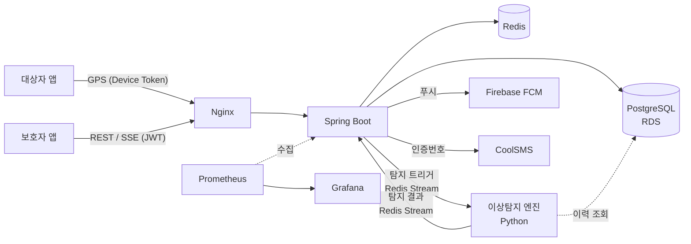

# Re;caRing

> 보호가 필요한 가족을 여러 사람이 함께 돌보는 위치 기반 케어 서비스 — 백엔드 서버

치매 어르신처럼 혼자 외출하면 길을 잃기 쉬운 가족을 돌보는 일은 보호자 한 명이 온종일 감당하기 어렵습니다.
Re;caRing은 보호 대상자는 평소처럼 생활하고, 보호자는 **필요한 순간에만 알림을 받아 대응**할 수 있도록 돕습니다.

- 개발 기간: 2026.03 ~ 진행 중 (앱 출시 준비 중, 서버는 AWS 개발 환경에서 운영 중)
- 담당: 백엔드 설계·구현, 인프라 구축·배포·운영

<br>

## 주요 기능

| 기능 | 설명 |
|------|------|
| **실시간 위치 공유** | 대상자 앱이 보낸 위치를 보호자 화면에 SSE로 즉시 전달. 날짜별 이동 경로 조회 |
| **안심존** | 집·복지관 등 원형 영역을 등록하고, 진입·이탈 시 보호자에게 푸시 알림 |
| **이상 행동 감지** | 과속·배회·비정상 체류·경로 이탈·비정상 시간대 이동 5종을 탐지해 알림. 알림 위치를 이동 경로 위에 표시 |
| **배터리 알림** | 대상자 휴대폰 잔량이 보호자가 고른 기준 아래로 떨어지면 알림 (위치 끊김 예방) |
| **함께 돌보기** | 주보호자·보호자·관계자 3단계 권한으로 한 명을 최대 5명이 함께 돌봄. 초대·수락, 역할 변경, 주보호자 승계 |
| **회원·인증** | 휴대폰 인증 기반 가입, 카카오·네이버 로그인 연동, 알림함·알림 설정 |

<br>

## 시스템 구조



### 위치 한 건이 처리되는 흐름

1. 대상자 앱이 장기 인증용 **Device Token**으로 GPS를 전송 → 이력 저장 후 즉시 응답
2. 저장 이후의 작업은 **비동기 이벤트**로 분리 (가상 스레드)
   - 최신 위치를 Redis에 캐싱하고 해당 대상자를 보는 보호자들에게 **SSE 브로드캐스트**
   - **안심존·배터리**처럼 규칙이 정해진 판정은 서버에서 바로 처리
   - **이상 행동**은 Redis Stream으로 트리거만 발행하고, Python 엔진이 DB에서 이력을 직접 읽어 판정 (Claim-Check)
3. 엔진의 판정 결과를 서버가 Consumer Group으로 소비해 저장하고, 보호자별 알림 설정에 따라 FCM 발송

<br>

## 기술 스택

| 분류 | 사용 기술 |
|------|----------|
| Language / Framework | Java 21, Spring Boot 4, Spring Security, Spring Data JPA, QueryDSL |
| Database / Cache | PostgreSQL 16 (AWS RDS), Redis 7 (Cache, Stream) |
| 인증 | JWT (Access / Refresh), Device Token, OAuth2 (Kakao, Naver) |
| 외부 연동 | Firebase Cloud Messaging, CoolSMS, Kakao Local API |
| Infra | AWS ECS (EC2), ECR, RDS, S3, SSM, CloudWatch Logs, Nginx + Certbot |
| CI/CD | GitHub Actions (테스트 → 이미지 빌드 → ECR → ECS 무중단 배포) |
| Monitoring | Prometheus, Grafana (dashboard-as-code), node / redis exporter |
| Test | JUnit 5, Mockito, Testcontainers, k6 (부하 테스트) |

<br>

## 설계하며 고민한 점

### 1. 알림은 늦거나 빠지거나 중복되면 안 된다
- 탐지 결과는 `(대상자, 탐지 유형, 시각)` 유니크 키로 저장해 **재배달되어도 한 번만 처리**(멱등)
- 처리 도중 서버가 죽어 확인(ACK)되지 못한 메시지는 **Pending 메시지 재수거**로 다시 처리
- 안심존은 캐시하지 않고 매번 DB를 조회 — 존을 수정한 직후 옛 기준으로 오알림이 가는 것보다 정합성을 우선

### 2. 규칙 판정과 패턴 분석을 분리
- 안심존·배터리는 서버가 이미 필요한 정보를 모두 가지고 있어 서버 안에서 바로 판정
- 이상 행동처럼 통계 모델이 필요한 판정만 별도 엔진으로 분리하고, 메시지에는 데이터 대신 트리거만 담아 전송량을 줄임
- 단일 EC2 환경에서 Kafka·Lambda 대신 **이미 쓰고 있는 Redis Stream**을 선택해 운영 부담을 낮춤

### 3. 여러 사람이 함께 돌볼 때 생기는 예외 상황
- 주보호자가 떠나면 남은 사람 중 규칙(보호자 → 관계자, 먼저 등록한 순)에 따라 **자동 승계**
- 주보호자끼리 서로를 내보내는 상황을 막기 위해 주보호자는 강등·추방 불가, 승격으로만 증가
- 관계가 끊긴 전 보호자가 예전 키로 다른 대상자의 안심존에 접근하지 못하도록 조회 범위를 대상자 단위로 제한

### 4. 작은 인프라에서 안정적으로 운영
- t3.medium 한 대 위에 ECS로 앱·Nginx·모니터링·탐지 엔진을 올리고, 컨테이너별 메모리·CPU 예산을 직접 산정
- 배포 실패 시 서킷 브레이커로 자동 롤백, 서버 접근은 SSH 없이 **SSM Session Manager**로만 허용
- SSE 연결 수·전송 실패·브로드캐스트 지연 등 도메인 지표를 직접 계측해 Grafana로 관찰, k6로 GPS·SSE 부하 테스트

<br>

## 코드 구조

도메인별로 패키지를 나누고, 각 도메인 안에서 **Controller → Business → Implement → DataAccess** 순방향 참조만 허용합니다.

```
src/main/java/com/recaring/
├── auth/            # 로컬·OAuth 인증, 토큰 발급
├── care/            # 케어 초대, 케어 관계·권한
├── device/          # 대상자 기기용 Device Token
├── location/        # GPS 수신, SSE, 안심존·배터리·이상탐지 판정
├── member/          # 회원 정보, 탈퇴
├── notification/    # 알림함, 알림 설정, FCM
├── safezone/        # 안심존 관리
├── place/           # 장소 검색 (Kakao Local 프록시)
├── sms/             # 휴대폰 인증
└── security/ · config/ · common/ · support/

{domain}/
├── controller/      # API, Request / Response
├── business/        # 유스케이스 흐름 조합
├── implement/       # Reader · Writer · Manager · Validator
├── dataaccess/      # Entity, Repository
└── vo/              # 계층 간 전달하는 불변 도메인 객체
```

<br>

## 로컬 실행

```bash
docker compose -f docker-compose-local.yml up -d   # PostgreSQL, Redis
./gradlew bootRun --args='--spring.profiles.active=local'
```

- API 문서: `http://localhost:8080/swagger-ui/index.html`
- 테스트: `./gradlew test` (단위), `./gradlew integrationTest` (Testcontainers 통합)

<br>

## 문서

- [기능 명세서](docs/기능명세서.md)
- [Grafana SSE 대시보드](docs/grafana-sse-dashboard.json)
